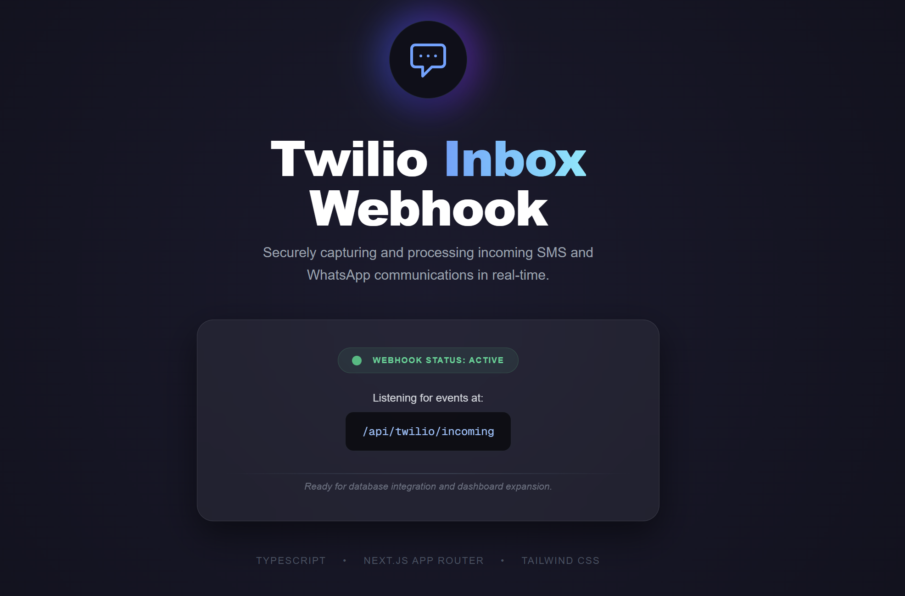

# Kapuletu: Twilio Inbox & Messaging Platform



Kapuletu is a production-ready messaging platform built with **Next.js 16**, **TypeScript**, and **Tailwind CSS**. It provides a robust architecture for receiving and processing incoming SMS and WhatsApp messages via Twilio Webhooks.

## 🚀 Features

-   **Multi-Channel Support**: Seamlessly handle both SMS and WhatsApp communications.
-   **Advanced Parser**: Custom-built utility to extract message data, sender info, and multiple media attachments from Twilio's sequential payload.
-   **Service-Oriented Architecture**: Clean separation between API routes and business logic, fully prepared for database integration.
-   **Premium UI**: A high-end, responsive dashboard designed with modern gradients and glassmorphism.
-   **TwiML Automated Responses**: Built-in intelligent auto-reply logic for immediate user feedback.

## 🛠️ Tech Stack

-   **Framework**: [Next.js 16](https://nextjs.org/) (App Router)
-   **Language**: [TypeScript](https://www.typescriptlang.org/)
-   **Styling**: [Tailwind CSS 4](https://tailwindcss.com/)
-   **Communication**: [Twilio Webhooks](https://www.twilio.com/)
-   **Tunneling**: [ngrok](https://ngrok.com/) / [localtunnel](https://theboroer.github.io/localtunnel-www/)

## 📁 Project Structure

```text
├── app/
│   ├── api/twilio/incoming/  # Webhook POST endpoint
│   ├── page.tsx              # Main Dashboard UI
│   └── layout.tsx            # Global metadata & styles
├── lib/
│   ├── twilio-parser.ts      # Logic for extracting Twilio FormData
│   └── message-service.ts    # Service layer for future DB logic
└── public/
    └── main-page.png         # Project Screenshot
```

## 🚥 Getting Started

### 1. Installation
```bash
npm install
```

### 2. Run Locally
```bash
npm run dev
```

### 3. Exposing the Webhook
Use `ngrok` or `localtunnel` to expose your local port 3000 to the internet so Twilio can reach your machine:
```bash
npx localtunnel --port 3000
```

### 4. Twilio Configuration
Set your Twilio Messaging Webhook to:
`https://<your-tunnel-url>/api/twilio/incoming`

## 📖 Documentation
For detailed information on moving to production, branding, and cost structures, please refer to the **[Twilio Production Guide](./docs/TWILIO%20PRODUCTION%20GUIDE.md)** created in the `docs` folder.

---
Built with ❤️ for **Kapuletu**
